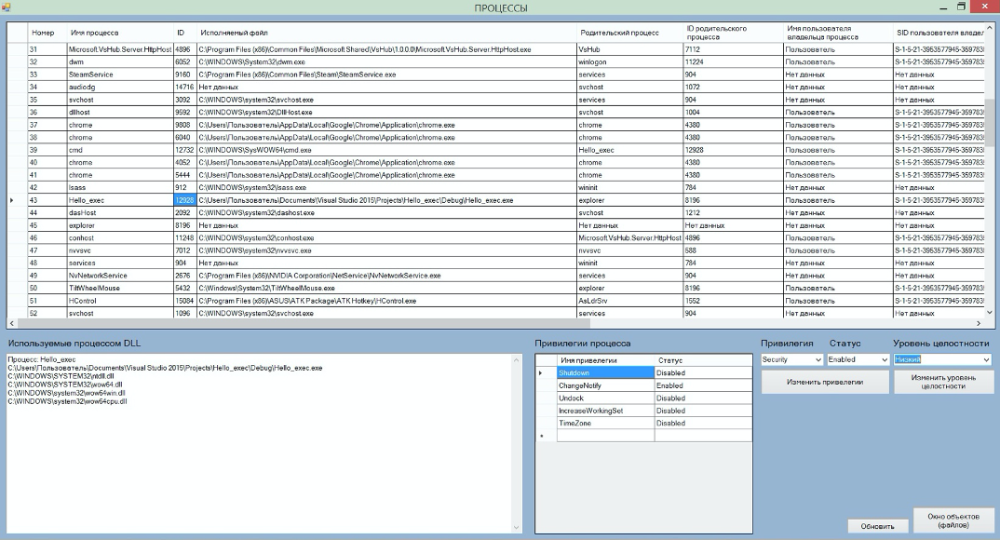
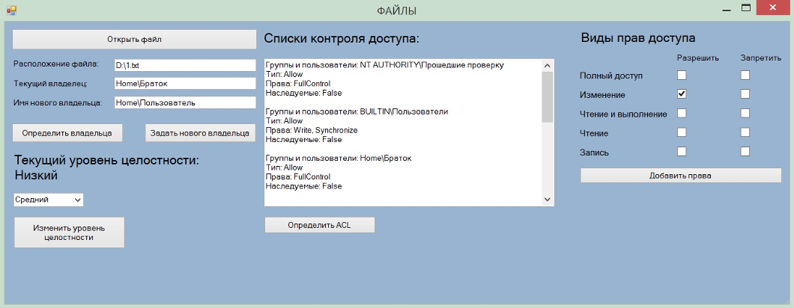

# Process monitor

Программа с графическим интерфейсом, осуществляющая вывод и изменение различных прав субъектов по отношению к различным объектам ОС Windows, а также другой информации о процессах, функционирующих в ОС

## Installation

Для корректной работы требуется:
+ ОС Windows 7 x64 или выше 
+ .NET Framework версии 4.5.2. 
+ Необходимо перенести в директорию "C:\" файл IntegrityLevelx64.dll, который находится в папке "MBKS_II"

## Description

Интерфейс окна для работы с процессами приведен ниже. Программа осуществляет вывод всех процессов системы, определяет и выводит в таблицу для каждого процесса: его идентификатор, путь до исполняемого файла, имя и идентификатор родительского процесса, имя пользователя владельца процесса и его идентификатор, тип процесса, использование механизмов безопасности DEP и ASLR, список библиотек, приоритет процесса. При нажатии на ID процесса, в окне, расположенном под таблицей, отображаются все библиотеки, используемые этим процессов. Также для каждого процесса можно увидеть его привилегии, изменить их и изменить уровень целостности. 

Интерфейс окна для работы с файлами системы приведен ниже. Для любого файла можно изменить его владельца, посмотреть списки контроля доступа, изменить права доступа, изменить уровень целостности.

